# Python CI/CD Hello World Project

This repository is a simple example project to demonstrate a CI/CD pipeline using Python, GitHub Actions, and various development tools. The project starts with a "Hello World" script and includes tooling for code coverage, automated testing, linting, and more.

## Project Structure

```
python-ci-cd-hello-world/
├── .github/
│   └── workflows/
│       └── python-ci.yml
├── .devcontainer/
│   └── devcontainer.json
├── src/
│   └── main.py
├── tests/
│   └── test_main.py
├── .coveragerc
├── .flake8
├── pyproject.toml
├── requirements.txt
├── README.md
└── setup.cfg
```
## How a Commit moves throught the Github Actions

```mermaid
graph LR
    A[Commit is Pushed] -->|Triggers| B[GitHub Actions Workflow]
    B --> C[Job: Build]
    C --> D[Checkout Code]
    D --> E[Set Up Python]
    E --> F[Install Dependencies]
    F --> G[Lint Code with Flake8]
    G --> H[Format Code with Black]
    H --> I[Run Tests]
    I --> J[Upload Coverage to Codecov]
    J --> K[Workflow Completes]
```



## Getting Started

### Prerequisites

- Python 3.x
- Git

### Installation

1. **Clone the repository:**

   ```bash
   git clone https://github.com/chrismarksus/python-ci-cd-hello-world.git
   cd python-ci-cd-hello-world
   ```

2. **Set up a virtual environment:**

   ```bash
   python -m venv venv
   source venv/bin/activate  # On Windows, use `venv\Scripts\activate`
   ```

3. **Install the dependencies:**

   ```bash
   pip install -r requirements.txt
   ```

### Running the Project

1. **Run the "Hello World" script:**

   ```bash
   python src/main.py
   ```

### Running Tests

1. **Run the tests:**

   ```bash
   coverage run -m unittest discover
   ```

2. **Generate a coverage report:**

   ```bash
   coverage report
   ```

### Linting and Formatting

1. **Lint the code:**

   ```bash
   flake8 src tests
   ```

2. **Format the code:**

   ```bash
   black src tests
   ```

## CI/CD Pipeline

This project uses GitHub Actions to automate testing and code quality checks. The configuration is located in `.github/workflows/python-ci.yml`. The pipeline includes:

- Checking out the code
- Setting up Python
- Installing dependencies
- Running linting with Flake8
- Checking code formatting with Black
- Running tests and generating a coverage report
- Uploading coverage results to Codecov

## Development Environment

This project includes a configuration for GitHub Codespaces, located in `.devcontainer/devcontainer.json`, to set up a consistent development environment using VS Code.

## How to Contribute

We welcome contributions to this project! Follow the steps below to get started:

### Step 1: Fork the Repository

1. Navigate to the repository on GitHub.
2. Click the "Fork" button in the top-right corner to create your own copy of the repository.

### Step 2: Clone Your Fork

Clone your forked repository to your local machine:

```bash
git clone https://github.com/your-username/python-ci-cd-hello-world.git
cd python-ci-cd-hello-world
```

### Step 3: Create a Branch

Create a new branch for your feature or bug fix:

```bash
git checkout -b feature/your-feature-name
```

### Step 4: Set Up the Development Environment

1. Create a virtual environment:

   ```bash
   python -m venv venv
   source venv/bin/activate  # On Windows, use `venv\Scripts\activate`
   ```

2. Install the required dependencies:

   ```bash
   pip install -r requirements.txt
   ```

### Step 5: Make Your Changes

Make your changes to the codebase. Ensure your code follows the project's coding standards and passes all tests.

### Step 6: Run Linting and Tests

1. **Lint your code:**

   ```bash
   flake8 src tests
   ```

2. **Format your code:**

   ```bash
   black src tests
   ```

3. **Run tests:**

   ```bash
   coverage run -m unittest discover
   coverage report
   ```

### Step 7: Commit Your Changes

Commit your changes with a meaningful commit message:

```bash
git add .
git commit -m "Description of your changes"
```

### Step 8: Push to Your Fork

Push your changes to your forked repository:

```bash
git push origin feature/your-feature-name
```

### Step 9: Create a Pull Request

1. Navigate to the original repository on GitHub.
2. Click the "New Pull Request" button.
3. Select your fork and branch as the source, and the original repository and branch as the destination.
4. Fill in the necessary details and create the pull request.

### Additional Notes

- Ensure your code passes all CI checks.
- Update documentation and add tests as needed.
- Be responsive to feedback on your pull request.

Thank you for contributing!
